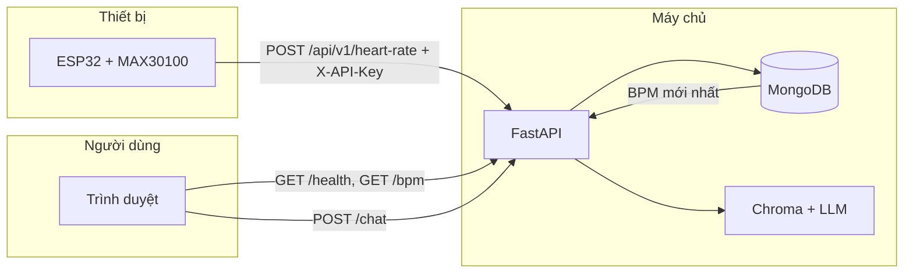

# Heart Monitor System — Hệ thống theo dõi nhịp tim AIoT

Dự án gồm **thiết bị ESP32** đo nhịp tim, **backend FastAPI** lưu dữ liệu và phục vụ AI (RAG), và **giao diện web** React hiển thị BPM, biểu đồ và chat trợ lý sức khỏe.

---

## Cấu trúc thư mục

```
heart_monitor_system/
├── backend/                 # API FastAPI + MongoDB + RAG (Gemini/OpenAI)
│   ├── app/
│   │   ├── main.py          # Khởi tạo app, CORS, lifespan (Mongo + RAG)
│   │   ├── config.py        # Biến môi trường (.env)
│   │   ├── models.py        # Schema Pydantic
│   │   ├── deps.py          # Xác thực X-API-Key (ESP / API bảo mật)
│   │   ├── routers/
│   │   │   ├── heart.py     # POST /api/v1/heart-rate (ESP)
│   │   │   ├── doctor.py    # POST /api/v1/virtual-doctor (RAG, có API key)
│   │   │   └── web_compat.py# GET /bpm, POST /chat (cho trình duyệt)
│   │   └── services/
│   │       ├── mongodb_store.py   # Ghi/đọc MongoDB
│   │       └── rag_doctor.py      # Chroma + LLM tư vấn
│   ├── knowledge/           # Tài liệu RAG (PDF/TXT)
│   ├── chroma_data/         # Vector store (tự tạo khi chạy)
│   ├── requirements.txt
│   ├── .env.example
│   └── run_lan.ps1          # Gợi ý chạy API cho cả mạng LAN (ESP)
│
├── frontend/                # Dashboard React + Vite + Tailwind
│   └── src/app/             # App.tsx, components (BPM, chart, chat…)
│
└── firmware/
    └── esp32_bpm_post/
        ├── esp32_bpm_post.ino   # Sketch ESP32-C3 + MAX30100 + nút đo 10s
        ├── WIRING.md            # Sơ đồ đấu dây
        ├── KET_NOI_WEB.md       # Nối ESP với PC / web / firewall
        └── PATCH_MAX30100_WIRE.md
```

---

## Luồng dữ liệu và vai trò từng phần



1. **Firmware (ESP32)**  
   - Kết nối WiFi, gửi bản ghi nhịp tim lên backend qua **HTTP POST** (header `X-API-Key` trùng `HEART_API_KEY` trong `.env`).  
   - Sketch hiện tại: **nút bấm** → đo **10 giây** → gửi **một lần** BPM (cảnh báo còi khi BPM ngoài ngưỡng tùy cấu hình).

2. **Backend (FastAPI)**  
   - **MongoDB**: lưu collection `heart_readings` (bpm, device_id, sensor, thời gian…).  
   - **GET `/health`**: trạng thái API, có Mongo hay không, RAG đã sẵn sàng hay chưa.  
   - **GET `/bpm`**: BPM **mới nhất** cho dashboard (có thể lọc `device_id`).  
   - **POST `/chat`**: gửi câu hỏi + BPM trong context → RAG trả lời (dùng Gemini hoặc OpenAI tùy `.env`).  
   - **POST `/api/v1/heart-rate`**: endpoint chính thức cho **ESP** (bảo vệ bằng API key).  
   - **POST `/api/v1/virtual-doctor`**: tương tự chat nâng cao, cũng dùng API key.

3. **Frontend (React)**  
   - Gọi định kỳ **`/health`** và **`/bpm`** (cùng “base URL” backend).  
   - Khi backend OK nhưng chưa có dữ liệu: BPM có thể trống; khi có dữ liệu từ ESP: hiển thị và vẽ biểu đồ.  
   - **Chat**: `POST /chat`; nếu RAG lỗi có thể fallback mock trong UI.  
   - Dev: Vite **proxy** `/health`, `/bpm`, `/chat` → backend local (xem `vite.config.ts`).

---

## Cách vận hành (vận hành thường ngày)

| Bước | Việc cần làm |
|------|----------------|
| 1 | Bật **MongoDB** (local hoặc URI trong `.env`). |
| 2 | Tạo `backend/.env` từ `.env.example`, điền `MONGODB_URI`, `HEART_API_KEY`, và (tuỳ chọn) **Gemini** (`GEMINI_API_KEY`, `GEMINI_MODEL`…) hoặc **OpenAI** để bật RAG. |
| 3 | Chạy backend: `cd backend` → `python -m pip install -r requirements.txt` → `python -m uvicorn app.main:app --reload --host 0.0.0.0 --port 8000` (ESP trong LAN cần `--host 0.0.0.0`; có thể dùng `run_lan.ps1`). |
| 4 | Chạy frontend: `cd frontend` → `npm install` → `npm run dev` → mở URL Vite (thường `http://127.0.0.1:5173`). Trong **Cài đặt** có thể để trống base URL (proxy) hoặc nhập `http://<IP_máy_chủ>:8000` khi xem từ thiết bị khác. |
| 5 | Nạp firmware cho ESP: chỉnh `WIFI_SSID`, `WIFI_PASS`, `API_BASE_URL` = `http://<IP_PC>:8000`, `API_KEY` = `HEART_API_KEY`. Chi tiết: `firmware/esp32_bpm_post/KET_NOI_WEB.md` và `WIRING.md`. |

---

## Biến môi trường quan trọng (`backend/.env`)

| Biến | Ý nghĩa |
|------|---------|
| `MONGODB_URI`, `MONGODB_DB` | Kết nối và tên database |
| `HEART_API_KEY` | Khóa cho ESP (`X-API-Key`) và route có `verify_api_key` |
| `GEMINI_API_KEY` / `GEMINI_MODEL` | Bật RAG + chat bằng Gemini (nếu không dùng OpenAI) |
| `OPENAI_API_KEY` | Tuỳ chọn: ưu tiên nếu có (embeddings/chat OpenAI) |
| `CHROMA_PERSIST_DIR`, `KNOWLEDGE_*` | Vector store và file kiến thức RAG |
| `CORS_ORIGINS` | Cho phép trình duyệt gọi API (VD: `http://localhost:5173`, thêm IP nếu mở web từ điện thoại) |

---

## API tóm tắt

| Phương thức | Đường dẫn | Ai dùng | Ghi chú |
|-------------|-----------|---------|---------|
| GET | `/health` | Web | Trạng thái tổng quát |
| GET | `/bpm` | Web | BPM mới nhất từ MongoDB |
| POST | `/chat` | Web | Chat RAG (không bắt API key trong thiết kế hiện tại) |
| POST | `/api/v1/heart-rate` | ESP32 | JSON bpm + header `X-API-Key` |
| POST | `/api/v1/virtual-doctor` | Client có API key | Tư vấn RAG |

---

## Lưu ý an toàn & y tế

- Chỉ số BPM từ cảm biến quang học là **tham khảo**, không thay thế thiết bị y tế hay chẩn đoán bác sĩ.  
- **Không** đưa API key / `.env` lên kho mã công khai; đổi `HEART_API_KEY` khi triển khai thật.

---

## Tài liệu thêm trong repo

- `firmware/esp32_bpm_post/WIRING.md` — đấu dây ESP32-C3, MAX30100, nút, còi.  
- `firmware/esp32_bpm_post/KET_NOI_WEB.md` — nối ESP với PC, firewall, URL backend.  
- `frontend/README.md` — chạy riêng dashboard (npm).
